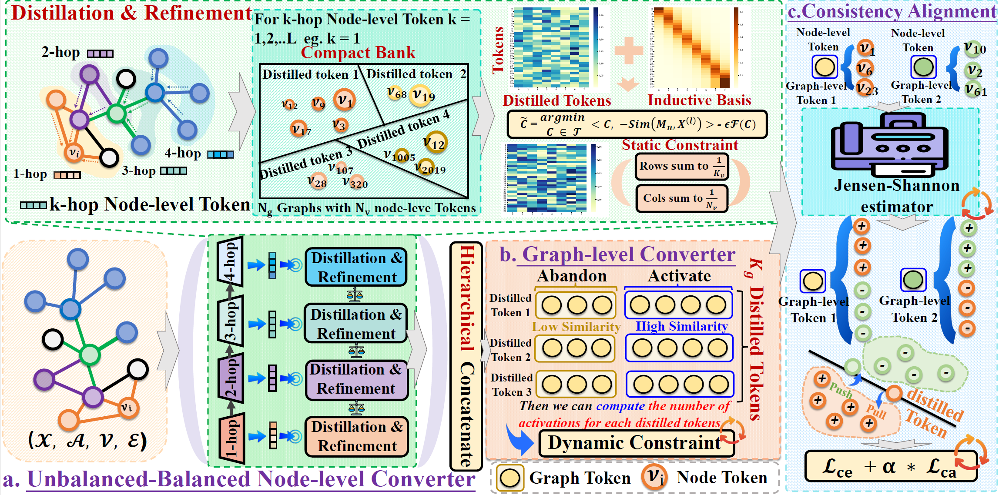

# U2B: Scale-unbiased Representation Converter for Graph Classification with Imbalanced and Balanced Scale Distributions（AAAI 2026)
We propose the Unbalanced-Balanced Representation Converter (U2B) based on [PyTorch](https://pytorch.org/) and [PyTorch Geometric](https://www.pyg.org/), a framework that mitigates bias toward specific graph scales through a two-step process: (1) a distillation phase that extracts base features from node-level and graph-level representations using static sinkhorn and dynamic constraints, respectively; and (2) a refinement phase that generates balanced representations. A consistency alignment loss further harmonizes node-level and graph-level features, producing more cohesive and scale-balanced graph representations. Extensive experiments across multiple datasets confirm the effectiveness of U2B.
## 📝 Overall architecture of U2B
<p align="center">

</p>

## Installation
You can easily reproduce the results of U2B by following the steps below:
#### Environment Requirements

Please ensure your Python environment meets  following dependencies:


| Dependency        | Version (≥) |
| ----------------- | ------------|
| Python            | 3.11.11     |
| PyTorch           | 2.3.0       |
| PyTorch-Geometric | 2.6.1       |
| scipy             | 1.15.2      |


#### [Recommended] Installation Steps
install required dependencies:

# Install dependencies
pip install -r requirements.txt
```
# Install dependencies
pip install -r requirements.txt
```
## Quick Start

main/: Run the experiments on Scale-imbalance, Scale-balance.

dataset_Split/: Contains Scale-Imbalance and Scale-balance datasets preprocessing methods

## Run
To reproduce results in our paper:
```linux
bash U2B.sh
```
